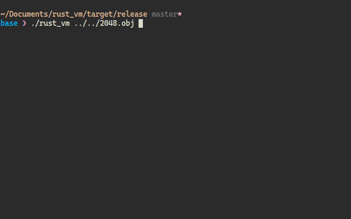
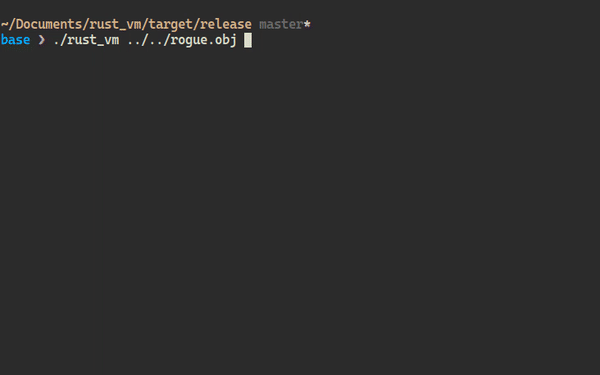
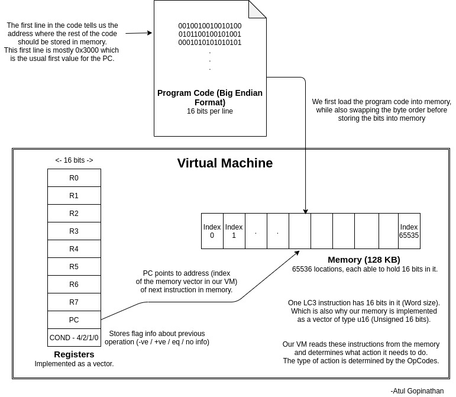

# LC-3_VM
用Rust编写的虚拟机，模拟了LC-3计算机(Little Computer 3) 逻辑基本是按下面文章的C语言版本实现的 [Write your Own Virtual Machine](https://www.jmeiners.com/lc3-vm/).

## 使用方法
1. 先编译项目 `cargo build --release`.
2. 进入项目根目录，运行 `target/release/lc-3_vm obj/2048.obj` 或 `target/release/lc-3_vm obj/rogue.obj`.
NOTE: 只能在unix系统中使用，windows不行

## 效果预览
### 2048 game

### Rogue game

## 关于VM的基础知识
1. 下面是一个从别处找来的VM工作流程图，以供参考:  

2. 存储器(Memory)和寄存器(Register)是模拟的主要硬件。我们的其余代码主要集中在从内存中读取指令，确定它是什么类型的指令（操作码），并执行相应的操作。要了解我们的虚拟机能够执行的不同操作码/指令类型，请参阅 [PDF](./assets/lc3-isa.pdf).

## 注意
1. LC-3 汇编代码是以 Big-Endian 字节顺序存储的，而X86-64架构是以 Little-Endian 格式存储，所以不同底层架构字节顺序可能会不同，使用时要根据实际情况实现代码.
2. Rust 不直接提供整数溢出的包装，但这在 C 代码中是正常的。 LC-3 汇编代码在添加带偏移量的地址时也广泛使用了这种整数溢出包装（请参阅“src\opcode.rs”中的代码）。 对于这种情况，必须使用 Rust 的 `wrapping_add()` 函数.